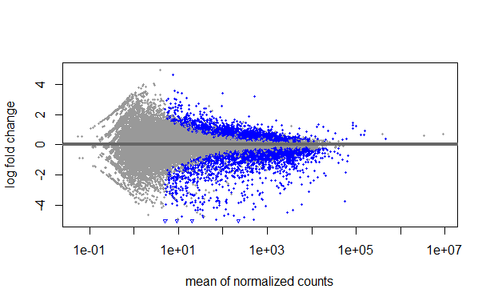

# Reproducible bulk RNA‑seq pipeline for prostate cancer hypoxia

End‑to‑end workflow for LNCaP and PC3 cell lines (hypoxia vs normoxia):
FASTQ QC → HISAT2 alignment → featureCounts → DESeq2, with documented
installation, decisions, and troubleshooting on an 8‑GB RAM laptop.

> Status: This repository is under active development. The core workflow is
> implemented; documentation and examples are being expanded.

## 1. Project overview
## 2. Experimental design
## 3. Data and SRA IDs
## 4. Pipeline steps
## 5. Installation and environment
## 6. Reproducing the analysis
## 7. Interpretation and results

#### 7.1 Differential expression analysis (DESeq2)

For the hypoxia vs normoxia comparison in LNCaP and PC3 prostate cancer cell lines, I reused a DESeq2 R script from a hands‑on bulk RNA‑seq analysis course. This script helped me understand how to set up the DESeq2 object, specify the design formula, and interpret differential expression results.

Instead of generating my own count matrix from FASTQ files, I used the tutorial count matrix `raw_counts.csv` from this repository:  
https://github.com/erilu/bulk-rnaseq-analysis/blob/7e02c51f8440126a5f674478e52b3273aa0770f2/raw_counts.csv

In this project, the script `R/workshop_deseq_analysis.R`:
- reads `data/counts/raw_counts.csv`
- defines cell line (LNCaP vs PC3) and condition (Hypoxia vs Normoxia)
- runs DESeq2 with the design `~ cell_line + condition`
- writes ordered results to `data/results/deseq2_results_normoxia_vs_hypoxia.csv`
- generates an MA‑plot of differential expression saved as `qc/MAplot_normoxia_vs_hypoxia.png`.

#### 7.2 MA-plot

The MA-plot shows log2 fold change (normoxia vs hypoxia) on the y-axis versus mean normalized counts on the x-axis, with many genes significantly differentially expressed across expression levels.

## 8. Limitations and future work

Ideally, this pipeline would include running alignment (HISAT2) and counting (featureCounts) locally from the raw FASTQ files. However, repeated memory crashes in WSL on my 8 GB RAM laptop prevented me from successfully completing the full alignment + counting workflow.

As a workaround, I used the tutorial count matrix (`raw_counts.csv`) instead of recomputing counts from FASTQ. To keep my work transparent, I have included:
- the shell script I used for alignment attempts in `scripts/align.sh`
- the alignment log file in `logs/alignment_log.txt`
- the DESeq2 analysis script in `R/workshop_deseq_analysis.R`

In future, I plan to rerun the complete workflow (alignment + counting + differential expression) on a higher‑memory machine or in the cloud and compare the resulting differentially expressed genes with the tutorial‑based results.

