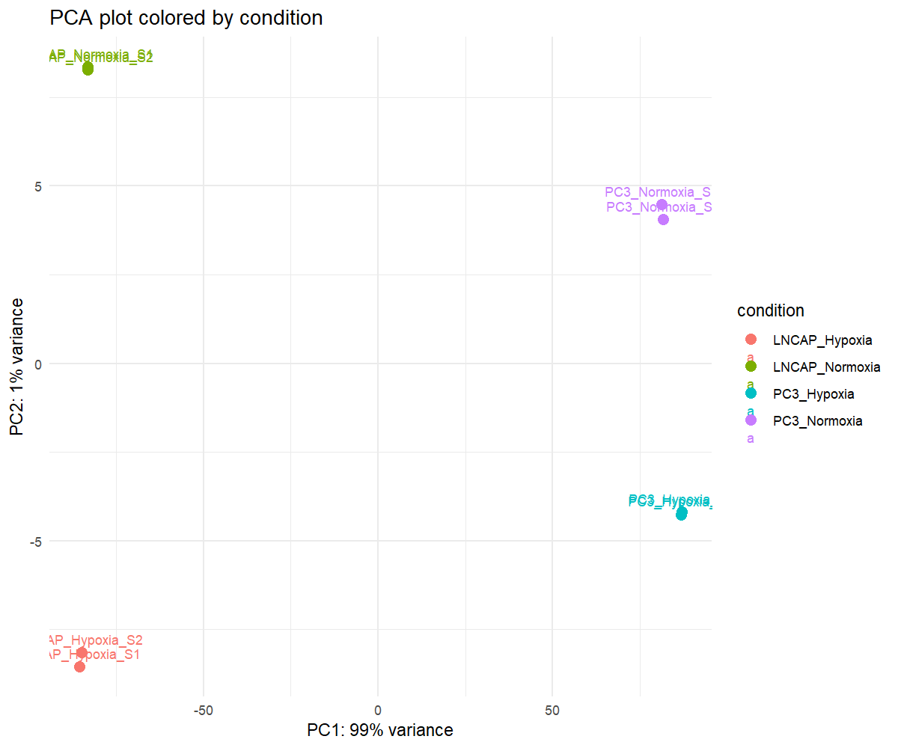
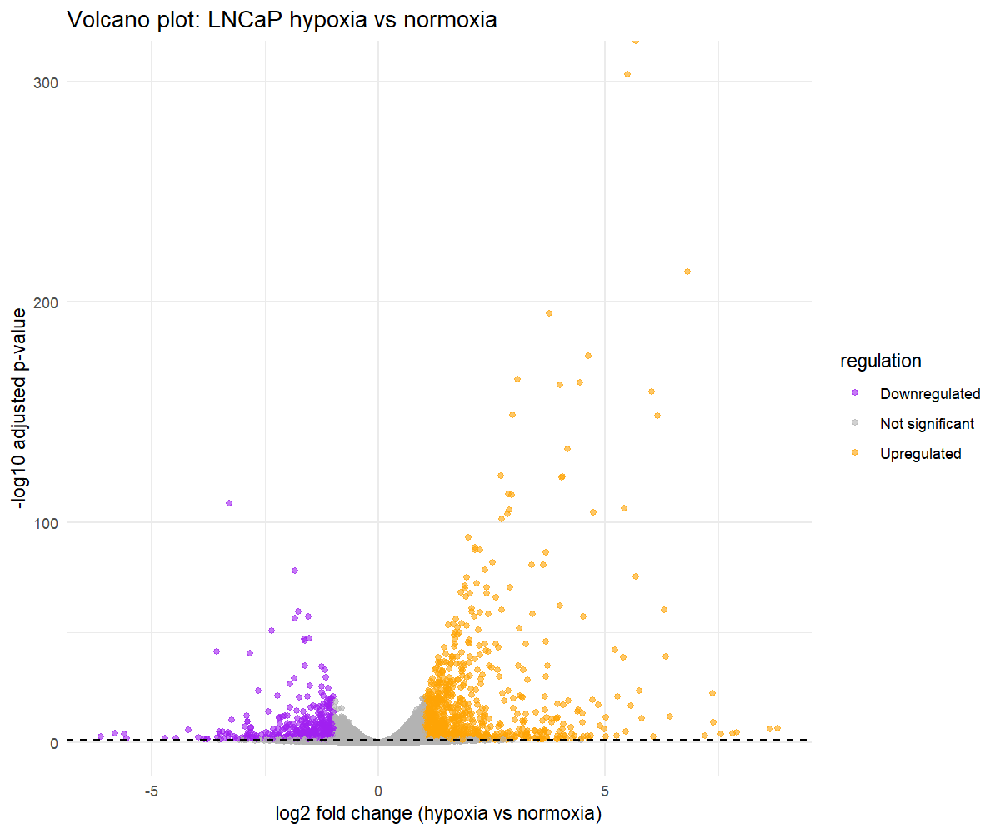

# Reproducible bulk RNA‑seq pipeline for prostate cancer hypoxia

End‑to‑end workflow for LNCaP and PC3 cell lines (hypoxia vs normoxia):
FASTQ QC → HISAT2 alignment → featureCounts → DESeq2, with documented
installation, decisions, and troubleshooting on an 8‑GB RAM laptop.

> Status: This repository is under active development. The core workflow is
> implemented; documentation and examples are being expanded.

## 1. Project overview
- Hypoxia is known to reprogram gene expression in prostate cancer cells and can influence tumor growth, metastasis, and treatment response.​

- This project uses bulk RNA‑seq data from LNCaP and PC3 prostate cancer cell lines to identify genes and pathways that differ between hypoxia and normoxia conditions.​

- The aim is to build a reproducible end‑to‑end analysis (QC → alignment/counts → DESeq2) and summarize the main transcriptional changes associated with hypoxia in these models.
## 2. Experimental design
- System: human prostate cancer cell lines LNCaP and PC3.
- Condition: each line cultured under normoxia (21% O₂) or hypoxia (1% O₂).
- Design: 2 cell lines × 2 conditions × 2 replicates = 8 RNA‑seq samples.
  - LNCAP_Hypoxia_S1, LNCAP_Hypoxia_S2
  - LNCAP_Normoxia_S1, LNCAP_Normoxia_S2
  - PC3_Hypoxia_S1, PC3_Hypoxia_S2
  - PC3_Normoxia_S1, PC3_Normoxia_S2
- Main contrasts of interest:
  - Hypoxia vs normoxia within LNCaP.
  - Hypoxia vs normoxia within PC3.
  - LNCaP vs PC3 at the same oxygen condition (exploratory).

## 3. Data and SRA IDs
For this project I worked with the GSE106305 prostate cancer RNA‑seq dataset (LNCaP and PC3, hypoxia vs normoxia). I downloaded 20 SRA runs:

- SRR7179504–SRR7179507  
- SRR7179508–SRR7179511  
- SRR7179520–SRR7179523  
- SRR7179524–SRR7179527  
- SRR7179536, SRR7179537, SRR7179540, SRR7179541  

I automated downloads with SRA‑Toolkit using a Python script: `scripts/download_sra_fastq.py`.

### 3.1 Background resources I studied

To understand bulk RNA‑seq design, analysis, and interpretation for this project, I read:

- Bulk RNA‑seq tutorial repo by Erick Lu (`bulk-rnaseq-analysis` on GitHub)  
- Review articles on omics and RNA‑seq interpretation:  
  - https://pmc.ncbi.nlm.nih.gov/articles/PMC10951429/  
  - https://sci-hub.hlgczx.com/10.1038/nrg.2018.4#gsc.tab=0  
  - https://pmc.ncbi.nlm.nih.gov/articles/PMC6954399/  
- ONECUT2 neuroendocrine prostate cancer paper (Guo et al. 2019, Nat. Commun.).

## 4. Pipeline steps

At a high level, this pipeline is designed to go from raw FASTQ files to differential expression:

- Download SRA FASTQ files
- Run FastQC and MultiQC
- Align reads to GRCh38 with HISAT2
- Count reads per gene with featureCounts
- Run DESeq2 for hypoxia vs normoxia
#### Why I selected HISAT2 instead of STAR

The original tutorial uses STAR for alignment, but for this project I chose HISAT2 because:

- HISAT2 has lower memory requirements than STAR, which is important on my 8 GB RAM laptop.
- HISAT2 is a splice‑aware aligner that is widely used for RNA‑seq and gives good quality alignments suitable for featureCounts and DESeq2.
- STAR is very fast but keeps large genome indices in memory, so it is harder to run reliably in a constrained WSL environment.

#### Why HISAT2 still did not complete on my laptop

I downloaded the GRCh38 HISAT2 index and GTF successfully, but the combined HISAT2 + samtools sort + samtools index steps were still too memory‑intensive for my 8 GB RAM WSL setup. The alignment jobs started (as shown in `logs/alignment_log.txt`) but crashed before producing BAM files for all samples. Because alignment is a very RAM‑consuming step, I could not complete the full HISAT2 → BAM → featureCounts pipeline on this machine.

## 5. Installation and environment
## 6. Reproducing the analysis
## 7. Interpretation and results
#### 7.1 Differential expression analysis (DESeq2)

For the hypoxia vs normoxia comparison in LNCaP and PC3 prostate cancer cell lines, I reused a DESeq2 R script from a hands‑on bulk RNA‑seq analysis course. This script helped me understand how to set up the DESeq2 object, specify the design formula, and interpret differential expression results.

Instead of generating my own count matrix from FASTQ files, I used the tutorial count matrix `raw_counts.csv` from this repository:  
https://github.com/erilu/bulk-rnaseq-analysis/blob/7e02c51f8440126a5f674478e52b3273aa0770f2/raw_counts.csv

In this project, the script `R/workshop_deseq_analysis.R`:
- reads `data/counts/raw_counts.csv`
- defines cell line (LNCaP vs PC3) and condition (Hypoxia vs Normoxia)
- runs DESeq2 with the design `~ cell_line + condition`
- writes ordered results to `data/results/deseq2_results_normoxia_vs_hypoxia.csv`
- generates QC plots saved in `qc/` (MA‑plot, PCA, volcano).

Across all plots below, I use the DESeq2 **adjusted p‑value (padj)** to define statistical significance. Genes with padj < 0.05 are treated as significantly differentially expressed after multiple‑testing correction.

#### 7.2 MA‑plot

The MA‑plot shows log2 fold change (normoxia vs hypoxia) on the y‑axis versus mean normalized counts on the x‑axis.

- Points highlighted in blue are genes with **padj < 0.05**, i.e. statistically significant hypoxia‑associated changes after multiple‑testing correction.
- Most significant genes appear at moderate to high mean normalized counts, where DESeq2 has greater statistical power, while very lowly expressed genes are shrunk toward a log2 fold change of 0 and are rarely significant.

#### 7.3 PCA plot (qc/PCA_normoxia_vs_hypoxia.png)

The PCA plot summarises variance across all genes and samples. PC1 (≈99% variance) separates LNCaP from PC3, showing that **cell line** is the dominant source of variation. PC2 (≈1% variance) separates hypoxia from normoxia within each line, indicating that oxygen condition has a smaller but consistent and statistically meaningful effect on global expression patterns.

#### 7.4 Volcano plot (qc/volcano_lncap_hypoxia_vs_normoxia.png)

In the volcano plot for LNCaP hypoxia vs normoxia:
- The x‑axis is log2 fold change (effect size), and the y‑axis is −log10(padj), so points higher on the plot are **more statistically significant**.
- Genes that pass the padj < 0.05 threshold appear as highlighted points: hypoxia‑upregulated genes on the right (positive log2FC) and downregulated genes on the left (negative log2FC).
- Genes that are both far from 0 on the x‑axis and high on the y‑axis have **large effect sizes and very low padj**, and are the most biologically and statistically important DE genes.

## 8. Limitations and future work

Ideally, this pipeline would include running alignment (HISAT2) and counting (featureCounts) locally from the raw FASTQ files. However, repeated memory crashes in WSL on my 8 GB RAM laptop prevented me from successfully completing the full alignment + counting workflow.

As a workaround, I used the tutorial count matrix (`raw_counts.csv`) instead of recomputing counts from FASTQ. To keep my work transparent, I have included:
- the shell script I used for alignment attempts in `scripts/align.sh`
- the alignment log file in `logs/alignment_log.txt`
- the DESeq2 analysis script in `R/workshop_deseq_analysis.R`

In future, I plan to rerun the complete workflow (alignment + counting + differential expression) on a higher‑memory machine or in the cloud and compare the resulting differentially expressed genes with the tutorial‑based results.

